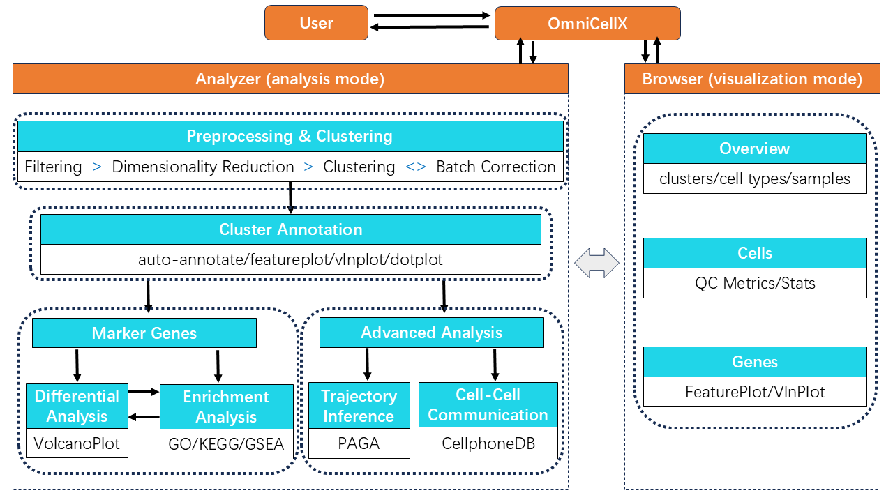

# OmniCellX
OmniCellX enables you to provide a browser-based interface to analyze or visualize single-cell data.



# Key Features
<ul>
  <li><b>Docker-based installation</b>: Simplifies deployment with no configuration needed, ensuring scalability for both small and large datasets.</li>
  <li><b>Dual-mode operation</b>:<ol><li>Analysis mode: Integrates tools for dimensionality reduction, clustering, differential expression, cell-cell communication, and trajectory inference.</li><li>Visualization mode: Offers interactive, customizable visuals for publication-ready figures.</li></ol></li>
  <li><b>Multi-format support</b>: Compatible with diverse single-cell platforms (e.g., 10x Genomics, Smart-seq2).</li>
  <li><b>Efficient data handling</b>: Uses AnnData objects for memory/computational efficiency, scaling to millions of cells.</li>
  <li><b>Customization</b>: Adjustable parameters enable real-time fine-tuning for tailored analyses.</li>
  <li><b>Comprehensive documentation</b>: Detailed guides and tutorials for troubleshooting and advanced use cases.</li>
</ul>

# Deployment and Usage
To install OmniCellX, you need to have Docker installed on your machine. Docker needs to be properly installed and configured in the user's machine.

<b>On local machines</b> :
```
docker pull longrw/omnicellx:latest
docker run -itd -p 8000:8000 longrw/omnicellx:latest
```
<b>or server (recommended)</b> :
```
docker pull longrw/omnicellx:latest
docker run -itd -p serverIP:8000:8000 -e ALLOWED_HOSTS="serverIP" longrw/omnicellx:latest
```
After successful installation, user can use omnicellx by `http://localhost:8000/omnicellx/`(<b>local</b>) or `http://serverIP:8000/omnicellx/`(<b>server</b>) through the web browser. Note that the `serverIP` should be replaced by real server IP address. <b>The detailed tutorials can be visited by clicking [](#) in the upper right corner of the tool page</b>.

# testdata
For application testing purposes, two sample datesets are included. These datasets were collected from https://figshare.com/articles/dataset/NeurIPS_2021_Benchmark_dataset/22716739 using the 10X Multiome Gene Expression kit.

# Documentations
- [Quick Start](#quick-start)
  - [1. Analysis Mode (OmniCellX as Analyzer)](#1-analysis-mode-omnicellx-as-analyzer)
  - [2. Visualization Mode (OmniCellX as Browser)](#2-visualization-mode-omnicellx-as-browser)
- [Analyzer Mode](#analyzer-mode)
  - [Preprocessing & Clustering](#preprocessing--clustering)
    - [1. Filtering](#1-filtering)
    - [2. Dimensionality Reduction](#2-dimensionality-reduction)
    - [3. Clustering](#3-clustering)
    - [4. Batch Effect (optional)](#4-batch-effect-optional)
  - [Cluster Annotation](#cluster-annotation)
  - [Marker Genes](#marker-genes)
    - [1. Differential Expression Analysis](#1-differential-expression-analysis)
    - [2. Enrichment Analysis](#2-enrichment-analysis)
  - [Advanced Analysis (optional)](#advanced-analysis-optional)
    - [1. Trajectory Inference](#1-trajectory-inference)
      - [1.1 PAGA](#11-paga)
    - [2. Cell-Cell Communication](#2-cell-cell-communication)
      - [2.1 CellphoneDB](#21-cellphonedb)
- [Browser Mode](#browser-mode)
  - [Clustering Overview](#clustering-overview)
  - [QC Metrics](#qc-metrics)
  - [Cell Stats](#cell-stats)
  - [FeaturePlot](#featureplot)
  - [VlnPlot & DotPlot](#vlnplot--dotplot)

## Quick Start
OmniCellX features two distinct modes: <b>Analysis Mode</b> and <b>Visualization Mode</b>. The Analysis Mode is primarily designed for raw single-cell data, performing dimensionality reduction, clustering, and annotation, among other analytical processes. Users can iteratively adjust parameters to achieve optimal results. The Visualization Mode, on the other hand, is dedicated to display pre-analyzed outcomes generated from the Analysis Mode or other external sources. In this mode, users can review, compare, and export results. Analysis plots generated by either mode are of high quality and can be exported for recording or publication purpose.

### 1. Analysis Mode (OmniCellX as Analyzer)
Upon selecting and entering the <b>Analysis Mode</b>, users can choose an existing analysis project via the <b>Project ID</b> to view, modify, or reanalyze it. Alternatively, they can initiate a new project by clicking the <button>Create New</button> button. When creating a new project, users are required to input a <b>Project ID</b> and sample information, and upload sample data. The sample information includes the <b>Source</b> of the sample data and the <b>Species</b> name. The data source offers four options, representing different formats of gene expression data:
<ul>
  <li><b>10X Matrix</b>: Matrix from Cell Ranger on 10X Genomics platform in the common tripartite directory, consisting of barcodes, features and counts files.</li>
  <li><b>10X Matrix (.h5)</b>: Matrix in .h5 format generated by Cell Ranger on 10X Genomics platform.</li>
  <li><b>Matrix (.txt)</b>: Matrix in plain text file(.txt), containing gene expression count matrices with gene annotation as row names and cell barcodes as columns names. 
  The values within each row are separated by tabs ('\t').</li>
  <li><b>Matrix (.h5ad)</b>: Matrix in .h5ad format.</li>
</ul>
The species name can be either <b>Human</b> or <b>Mouse</b>. After selecting the data source, users can submit the sample data with a unique identifier(<b>Sample ID</b>). Multiple samples can be added using the <button>Add another</button> button. Once all samples are submitted, clicking the <button>Save</button> button ensures the data is stored securely, enabling subsequent analysis. Prior to finalizing the project creation, users may set <b>Filtering Options</b> for basic data filtering, with the default setting as no filtering. Clicking <button>Submit</button> button will create the new project, which can later be accessed via its <b>Project ID</b> for further analysis. Additionally, users have the option to delete existing analysis projects using the <button>Clear</button> button.

### 2. Visualization Mode (OmniCellX as Browser)
When users select and enter the <b>Visualization Mode</b>, they can view the results of existing projects by choosing the <b>Project ID</b>. These projects may have been created in the <b>Analysis Mode</b> or uploaded as new projects via the <button>Upload New</button> button. When uploading a new project, users are required to specify the project ID, the data format for import, and the species information. Currently, the system only supports the import of <b>AnnData</b> data object in <b>h5ad</b> format, with species limited to Human and Mouse. Once the data is successfully imported, users must review or redefine the Meta information of the data to ensure that OmniCellX correctly identifies it. The redefinition includes specifying details such as <b>Sample</b>, <b>Cluster</b>, <b>Cluster Annotation</b>, and <b>Cluster Color</b>, with Sample, Cluster, and Cluster Annotation being mandatory fields. After selecting a project via its Project ID, users can view the project's results or export the project as a h5ad file for further analysis. Additionally, users also have the option to delete a project by using the <button>Clear</button> button. Note that this deletion functionality is restricted to projects created within the Visualization Mode. To delete projects generated in the Analysis Mode, users must navigate back to the Analysis Mode to perform the deletion.

## Analyzer Mode
### Preprocessing & Clustering
#### 1. Filtering

Filtering is a crucial step in scRNA-seq data analysis, aiming to ensure the quality and reliability of the data before downstream analysis. It involves the removal of low-quality cells, genes, or other artifacts that could skew the results and lead to inaccurate biological interpretations. To detect low quality cells, we need to define QC metrics, that allow us to separate high quality from low-quality cells. Generally,  there are a few QC metrics that are commonly used by researchers: 
<ul>
<li>The minimal number of unique genes detected in each cell</li>
<li>The minimal number of cells expressing a certain gene</li>
<li>The maximal percentage of mitochondrial genes counts in each cell</li>
</ul>
OmniCellX allows users to filter cells or genes by setting manual or automatic thresholds and inspect the plots for these computed QC metrics. Based on feedback from these plots, users can continuously adjust parameters until satisfactory results are achieved. Meanwhile, users can also examine the QC outcomes for each sample through the <b>Sample ID</b> options, which aid in selecting more appropriate QC parameters.

#### 2. Dimensionality Reduction

Dimensionality reduction is designed to simplify and visualize the complex, high-dimensional data generated from single-cell experiments. By transforming high-dimensional gene expression profiles into lower-dimensional representations, it facilitates visualization, clustering, and the discovery of biological patterns. However, careful application and interpretation are essential to ensure that the reduced data accurately reflects the underlying biology.

#### 3. Clustering

Clustering enables researchers to uncover the cellular composition and organization of complex tissues. By grouping similar cells based on their gene expression profiles, clustering provides insights into cell types, states, and heterogeneity.

#### 4. Batch Effect (<i>optional</i>)

Batch effects in single-cell RNA sequencing data are typically caused by technical variations arising from differences in experimental conditions, such as sample preparation, sequencing platforms, reagent batches, or laboratory protocols. These inconsistencies can introduce artificial and undesirable variations in gene expression profiles, which may obscure true biological signals. Therefore, identifying and correcting batch effects is a critical step in ensuring the accuracy and validity of scRNA-seq analyses. To mitigate these issues, batch effect correction methods (e.g., <a href="https://portals.broadinstitute.org/harmony/" target="_blank">Harmony</a>, <a href="https://www.nature.com/articles/nbt.4091" target="_blank">MNN</a>, or Seurat's data integration) are often applied during data preprocessing to ensure that observed variations reflect biological rather than technical differences.

### Cluster Annotation

After clustering cells based on their gene expression profiles, the next step is to assign biological identity meaning to these clusters. Cluster annotation is a repetitive and intricate task, often requiring multiple rounds of clustering, annotation, comparison, and validation to achieve ideal results. Fortunately, OmniCellX offers an intuitive and user-friendly interface for annotation, where users can directly edit cluster names(Click <span class="glyphicon glyphicon-edit" aria-hidden="true"></span>) and colors(Click color-block<span style="display: inline-block; background-color: blue; width: 15px; height: 15px; margin-top: 2px; border-radius: 2px; margin-left: 5px;"></span>). Additionally, users can <button>Merge</button> two or more clusters into a single cluster, providing flexibility in refining annotations. Subclustering, a common step in cell type annotation, is also supported. Users can select a potential cluster and click the <button>SubCluster</button> button to enter the re-clustering analysis page. By adjusting parameters such as <b>resolution</b>, users can explore different clustering outcomes. Note that users must click the <button>Save</button> button to apply the desired results in subsequent analyses. 

Cell annotation involves various methods, such as examining the expression of known cell type markers across clusters or comparing data with reference datasets. OmniCellX provides essential auxiliary tools to assist in this process, including <button>AutoAnnotate</button>, <button>FeaturePlot</button>, and <button>VlnPlot</button>, which can be toggled on or off with a click. AutoAnnotate integrates automated annotation tools like <a href="https://github.com/dviraran/SingleR" target="_blank">SingleR</a> and <a href="https://www.celltypist.org/" target="_blank">CellTypist</a>. Based on our experience, we selected <b>CellTypist</b> as the primary automated annotation tool for OmniCellX, with plans to incorporate other tools in the future. FeaturePlot and VlnPlot are highly effective and commonly used tools for visualizing the expression of known cell type markers within the dataset, aiding in accurate cell type identification. To enhance efficiency, users can pre-upload marker genes via the <button>Upload</button> button, eliminating the need for repeated manual input during the annotation process.

### Marker Genes
#### 1. Differential Expression Analysis
After completing clustering, users can perform differential expression analysis to identify markers for each cluster(<b>Markers in Each Cluster</b>). Once cell annotation is finalized, users can further conduct differential analysis between any two cell types(<b>Markers between Cell Types</b>). Additionally, users can examine the differential expression of a specific cell type under different experimental conditions by selecting the experimental and control groups using the <button>Group</button> button(<b>Markers in Pair</b>). OmniCellX provides two commonly used statistical methods(<b>Test Method</b>) for this purpose. After submitting the analysis, users can view the results on the interface. By default, the violin plot displays the top ten markers with the highest scores, while a table lists all identified markers. The table consists of eight columns, each with specific meanings: 
<ul>
<li><b>ID</b>: ID number.</li>
<li><b>Features</b>: Gene names ranked by their significance in differentiating the groups. For each group, the top differentially expressed genes are listed in order of importance (e.g., most upregulated or downregulated).</li>
<li><b>Scores</b>: Statistical scores (e.g., t-test, Wilcoxon, or logistic regression scores). Higher absolute values indicate stronger differential expression.</li>
<li><b>Logfoldchanges</b>: The log2 fold change in gene expression between the group of interest and the reference group. Positive values indicate upregulation in the group of interest. Negative values indicate downregulation in the group of interest.</li>
<li><b>Pvals</b>: The p-value for each gene, indicating the statistical significance of the differential expression. Lower p-values suggest stronger evidence that the gene is differentially expressed.</li>
<li><b>Pvals_adj</b>: P-values adjusted for multiple testing using the Benjamini-Hochberg method. These are more reliable for identifying significant genes while controlling for false discoveries.</li>
<li><b>Fraction(Target)</b>: The fraction of cells expressing the genes in Target group.</li>
<li><b>Fraction(Reference)</b>: The fraction of cells expressing the genes in Reference group.</li>
</ul>
Users can click the <button>VlnPlot</button> button at the top right of the table to visualize selected markers of interest via violin plot. The <button>Download</button> button allows users to download either selected markers or the entire list. Additionally, users can search for specific genes of interest using the search box(<b>Gene Symbol</b>).

#### 2. Enrichment Analysis

Enrichment analysis will be performed after generating the marker table through differential expression analysis. By clicking the <button>Enrichment Analysis</button> button above the table, users can analyze the differential results. The <b>VolcanoPlot</b> provides options for filtering markers based on specific criteria. After submission, the filtered markers will be visualized, and separate lists of up- and down-regulated genes are provided. Users can click the <button>GO/KEGG</button> button to enter the enrichment analysis page for these genes or use the <button>Save</button> button to download the lists for custom analysis. For <b>OverRepresentation Analysis (ORA)</b>, users can input markers and select known gene sets (e.g., GO or KEGG) for enrichment analysis. <b>Gene Set Enrichment Analysis (GSEA)</b> is another tool that differs from ORA by utilizing all genes in the table rather than a filtered subset. Similarly, users must select a known gene set before performing GSEA enrichment analysis.

### Advanced Analysis (<i>optional</i>)

#### 1. Trajectory Inference

Single-cell trajectory analysis is used to model and understand the dynamic processes of cell development and differentiation at the single-cell level. It infers the progression of cells through various biological states, such as differentiation or response to stimuli, by ordering cells along a trajectory based on their gene expression profiles. This type of analysis can address several key questions in biology and medicine, including:
<ol>
<li>Identifying the sequence of gene expression changes during cell differentiation or development.</li>
<li>Discovering novel cell states or transitions that are not apparent in static analyses.</li>
<li>Understanding the mechanisms underlying cellular decision-making processes.</li>
<li>Predicting the outcomes of cellular perturbations, such as drug treatments or genetic modifications.</li>
</ol>
Currently, there are several widely-used tools for trajectory analysis, such as <a href="https://cole-trapnell-lab.github.io/monocle-release/" target="_blank">Monocle</a>, <a href="https://pubmed.ncbi.nlm.nih.gov/29914354/" target="_blank">Slingshot</a> and Partition-based Graph Abstraction (<a href="https://github.com/theislab/paga" target="_blank">PAGA</a>). OmniCellX performs trajectory analysis using PAGA.

##### 1.1 PAGA

PAGA is a method that provides a graph-like map of single-cell data, which can be used to infer trajectories and relationships between different cell clusters. Users can select a subset of data of interest and preset the cluster containing the root cell. After submission, PAGA and DPT (Diffusion Pseudotime) analyses will be performed. Based on the visualization results, users can adjust the root cell to refine the analysis and achieve optimal outcomes. This iterative process allows for more accurate trajectory inference and pseudotime analysis.

 #### 2. Cell-Cell Communication

 To study the interactions and signaling pathways between different cells within a tissue or organism, cell communication analysis focuses on understanding how cells send, receive, and interpret signals to coordinate their functions, which is crucial for maintaining tissue homeostasis, development, and response to environmental changes. A few popular tools have been developed to conduct cell-cell communication analysis like <a href="https://www.cellphonedb.org/" target="_blank">CellphoneDB</a> or <a href="https://pubmed.ncbi.nlm.nih.gov/39289562/" target="_blank">CellChat</a>. These tools leverage scRNA-seq data to infer and analyze the complex networks of signaling interactions between cells. By identifying key ligand-receptor pairs and their associated pathways, they provide valuable insights into the mechanisms of cellular communication and coordination. In our platform, OmniCellX offers cell communication analysis with CellphoneDB(v5.0.0).

##### 2.1 CellphoneDB

CellphoneDB is a publicly available repository of curated receptors, ligands, and their interactions, combined with a statistical framework to analyze cell-cell communication from single-cell RNA sequencing data. Typically, OmniCellX automatically generates the <b>Counts file</b> and the <b>Meta file</b>, both of which are essential input files for running CellPhoneDB. CellPhoneDB offers multiple analysis approaches, such as <b>Simple Analysis</b> and <b>Statistical Analysis</b>, which users can select via the <b>Approach</b> option. Additionally, users can choose the gene identifier for the count data through the <b>Gene Identifier</b> option. By default, CellphoneDB will assume that you are using ensembl gene ids (counts-data ensembl as default). If you are using gene symbols, please indicate it by choosing the option of 'hgnc_symbol'. When a user submits an analysis at the first time, they will need to wait until the analysis is complete. Subsequent submissions will directly display the results from the previous run unless there are changes to the Meta data, such as updates to the cluster annotation information. In such cases, the user must first click the <button>Update Metadata</button> button to refresh the <b>Meta file</b>. After updating, submitting the analysis will trigger the task to be run from the beginning again. 

<b>Note that</b> your gene/protein ids must be <b>HUMAN</b>. If you are working with another species such as mouse, we recommend you to convert the gene ids to their corresponding HUMAN orthologues.

###### 2.1.1 Results overview

To provide summary of analysis, OmniCellX will display the number of significant interactions between each cell type pair using a heatmap plot, while also provide a table that lists all interactions. Users can search for interactions corresponding to specific <b>Cell Type Pair</b> by entering them into the input box, or they can click on the blocks within the heatmap to reveal interactions for a particular cell type pair. Additionally, the table features a download function, allowing users to click the <button>Download</button> button at the top left corner to obtain all interactions, selected interactions, or the heatmap image. To assist users in better exploration, OmniCellX includes both the <b>Built-in CellPhoneDB Database</b> and a curated <b>Immune-Checkpoint Database</b>. After identifying interactions of interest, users can easily query these databases to access annotation information, which aids in uncovering biological significance.

## Browser Mode

The cell browser is designed for the visualization of analysis results, offering multiple ways to explore cell types, QC metrics, cell composition, gene expression, and more. Note that the browser does not allow editing or modifying of any pre-generated results; it is solely for viewing or downloading analysis plot purpose.

### Clustering Overview

When a user selects a <b>Project ID</b> and submits it, the browser defaults to displaying the clustering results using UMAP. Users can change the visualization method via the <b>Reduction Method</b> option and switch between displaying cell annotations or samples using the <b>Stratified by</b> option. The <button>Download</button> button provides users with options to export the results, allowing them to adjust settings to obtain publication-ready figures.

### QC Metrics

By default, OmniCellX displays QC Metrics grouped by samples. Users can select samples of interest, add them to the member list, and submit to generate quality control plots for three key metrics: <b>nCount_RNA</b>, <b>nFeature_RNA</b>, and <b>percentage_MT</b>. Additionally, users can save selected samples as a custom group using the <button>Save as new Batches</button> button. This process can be repeated to create multiple custom groups. By switching the <b>Group by</b> option to "Batches", users can view these predefined groups. After selecting a group and adding it to the member list, submitting the request will display quality control plots for the specified group, enabling easy comparison across different sample sets.

### Cell Stats

Cell Stats provides statistics at the cellular level, focusing on cell proportions and gene distribution. The cell proportion analysis displays the percentage of each cluster or cell type within individual samples or sample groups. Meanwhile, the gene count distribution illustrates the distribution of gene counts per cell for each cluster or cell type across individual samples or the entire dataset. Users can easily download these results by clicking the <button>Download</button> button, facilitating further analysis or reporting.

### FeaturePlot

FeaturePlot visualizes the expression of each marker gene at the single-cell level. Using the <b>Item Class</b> option, users can quantify the number of cells expressing the marker within each cluster or cell type. By default, FeaturePlot displays the expression of a marker in a single dataset. However, users can also choose to compare the expression of the same marker across a pair of datasets(Check "show in pairs"). These paired datasets can either represent different sample groups within the same project or compare the current project with another project. To save the visualization, users can click the download icon(<span class="glyphicon glyphicon-download-alt" aria-hidden="true"></span>) located at the top right corner of the image.

### VlnPlot & DotPlot

Unlike FeaturePlot, VlnPlot and DotPlot displays the expression of a group of marker genes at the single-cell level. Users can input a set of markers either by adding them one by one or by directly entering them into the text box. This allows for a comprehensive visualization of multiple markers simultaneously, facilitating the comparison of their expression patterns across clusters or cell types.

# Citation
If you use OmniCellX in your research, please considering citing:
<ul>
<li>OmniCellX: A Versatile and Comprehensive Browser-Based Tool for Single-Cell RNA Sequencing Analysis. doi: <a href="https://doi.org/10.3390/biology14101437" target="_blank">10.3390/biology14101437</a></li>
</ul>
